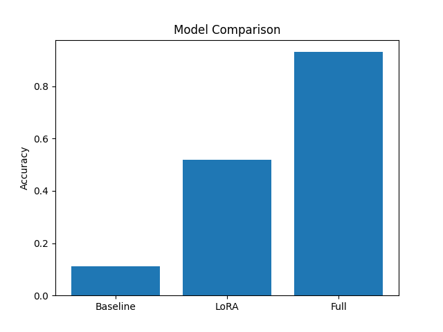

# 🎭 Emotion Detection using ALBERT

## 📌 Overview
This project detects emotions in tweets using the ALBERT transformer model.

## 🧠 Models Used
- Baseline Model (no training)
- Full Fine-Tuned Model
- LoRA Fine-Tuned Model

## 📊 Results

| Model      | Accuracy | F1 Score |
|------------|---------|---------|
| Baseline   | 0.1125  | 0.0255  |
| LoRA       | 0.5175  | 0.4108  |
| Full       | 0.9305  | 0.9290  |

## 📊 Model Comparison



## ⚙️ How to Run

### 1. Run Notebook
Open `notebook.ipynb` and run all cells.

### 2. Run Streamlit App
```bash
streamlit run app.py


